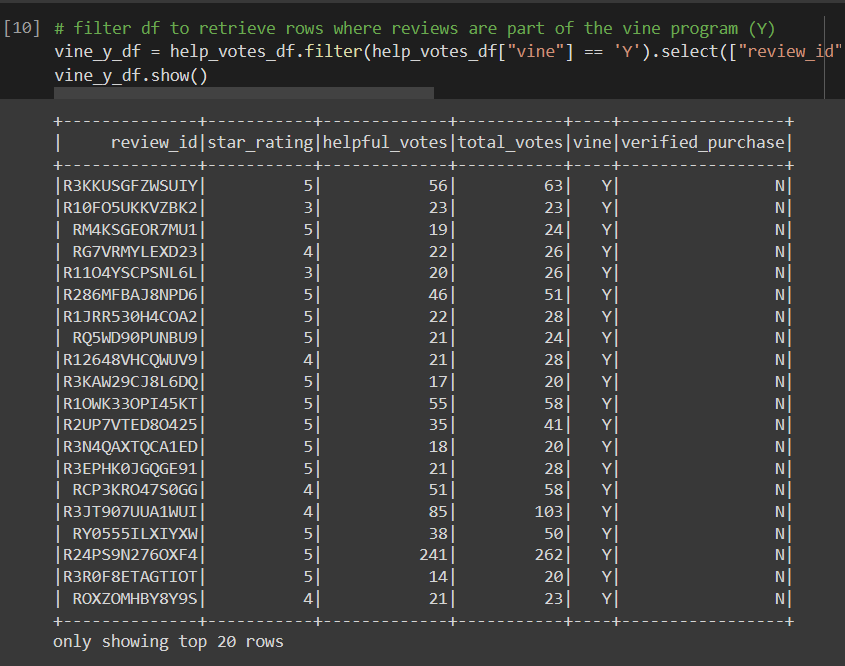
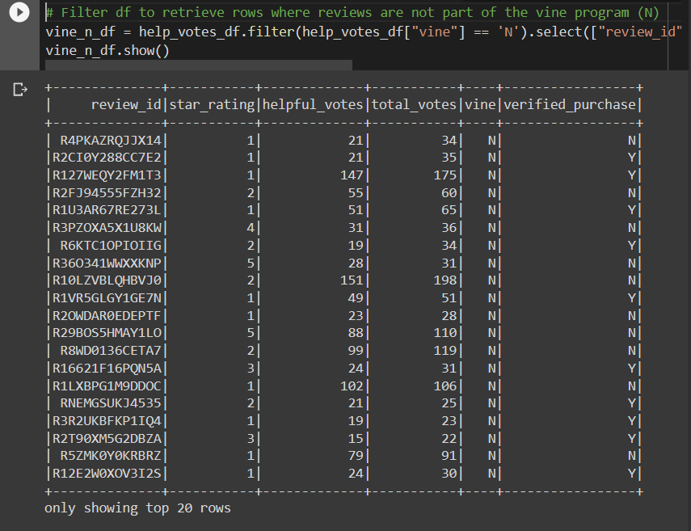
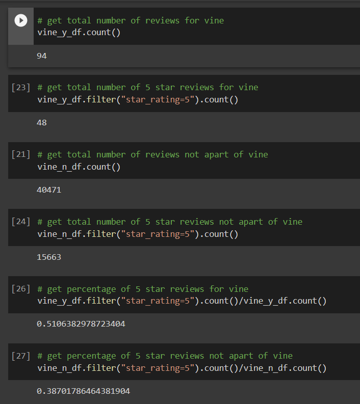

# Amazon Vine Analysis

## Overview

Using PySpark to determine whether there is any bias toward favorable reviews from Vine members found in the dataset.

## Results

Using bulleted lists and images of DataFrames as support, address the following questions:

- How many Vine reviews and non-Vine reviews were there?
  - The total Vine reviews came out to 94, and the total non-Vine reviews were 40,471.

- How many Vine reviews were 5 stars? How many non-Vine reviews were 5 stars?
  - There were 48 5-star Vine reviews. There were 15,663 5-star non-Vine reviews.

- What percentage of Vine reviews were 5 stars? What percentage of non-Vine reviews were 5 stars?
  - The percentage of Vine reviews that were 5-star was 51%. The percentage of non-Vine reviews that were 5-star was 39%.

Vine Reviews DF:

Non-Vine Reviews DF:

All calculated results displayed below:

## Summary

In your summary, state if there is any positivity bias for reviews in the Vine program. Use the results of your analysis to support your statement. Then, provide one additional analysis that you could do with the dataset to support your statement.

- There is a positivity bias for reviews in the Vine program as can be seen with the over 50% 5-star reviews on products. Another analysis that could be done with the dataset is to incorporate the "verified_purchase" column to get an even more detailed view of the data.

# Resources
- Data Source: [Amazon Video Game Reviews Dataset](https://s3.amazonaws.com/amazon-reviews-pds/tsv/amazon_reviews_us_Video_Games_v1_00.tsv.gz),
- Software: [Google Colab](https://colab.research.google.com/notebooks/welcome.ipynb), [Python](https://www.python.org/), [Visual Studio Code](https://code.visualstudio.com/), 1.65.2
